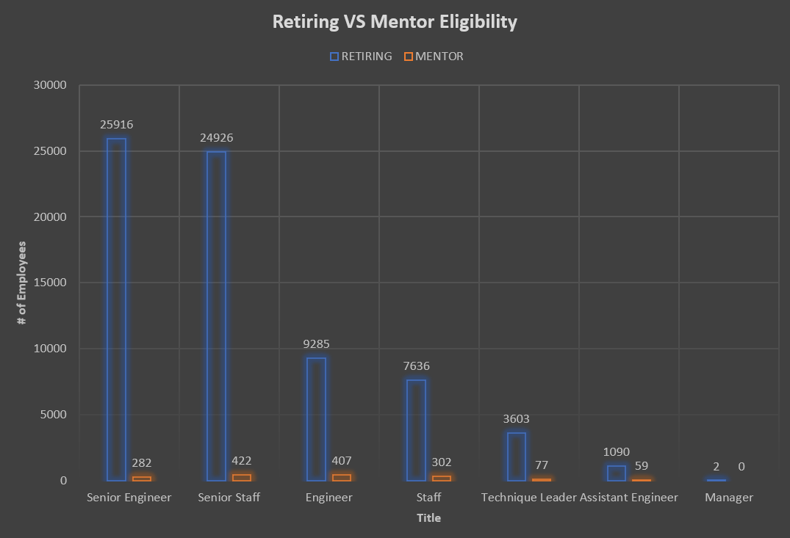
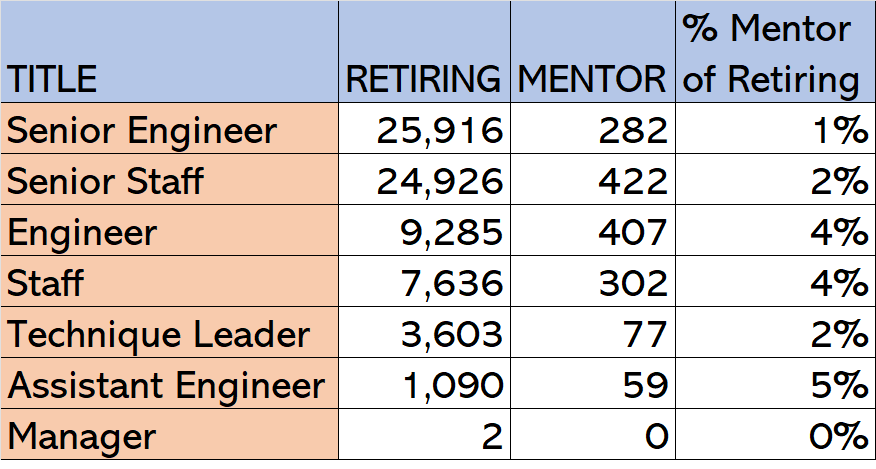

# Pewlett-Hackard-Analysis
## Overview of Project
### Purpose of Project
In this project, I demonstrated my proficiency with various features in SQL including: entity relationship diagrams (ERDs), creating new tables with into statements, exporting a CSV file, filtering queries, using join, on(), order by, and using aliases. To accomplish these goals, I was given a fictional situation and data set of six CSV files. 
### Background of Project
Pewlett Hackard, a large company with thousands of employees, is looking toward the future in two ways: (1) offering a retirement package for those who meet certain criteria and (2) identifying which positions will need to be filled in the near future. The objective of this project is to determine the number of retiring employees per title, identify employees who are eligible to participate in a mentorship program, and a written a summary analysis report to prepare Pewlett Hackard for the “silver tsunami” as many current employees reach retirement age.

---
## Results
 The following table and chart compare the number retirement-eligible employees to the mentorship-eligible employees by job title. 
 
 
 
 

 
 Major Takeaways 
* There are **72,459** retirement-eligible (born between January 1, 1952 and December 31, 1955) employees. 
* Senior Engineer and Senior Staff represent approximately 70% (50,842 positions) of the future hiring needs. 
* There are **1,549** mentorship-eligible (born between January 1, 1965 and December 31, 1965) employees.
* Given the current mentorship-eligibility requirements, each mentor-eligible employee would need to average 47 mentees to account for every new hire needed to return the workforce to scale.

---
## Summary 
The "silver tsunami" will consist of a projected **72,459** employees born between January 1, 1952, and December 31, 1955, meaning Pewlett-Hackard can expect to hire more than 70,000 new employees in a less than five-year period. Even if every employee born between January 1, 1965, and December 31, 1965 (**1,549** employees) fulfills a mentor role for the new hires, the number of new hires will overwhelm the qualified, retirement-ready employees. 

In order to mentor the next generation, Pewlett-Hackard should consider expanding mentor requirements. Additional queries to consider:
* Would expanding the mentor requirements from 1 year to 3 years or 5 years be able to match at least 10% of retiring employees? 
* Rather than age or in addition to age, should Pewlett Hackard consider years of experience in the given job title as requirement for mentorship? 

